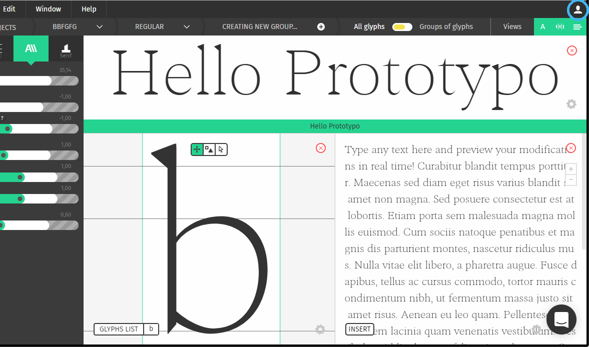
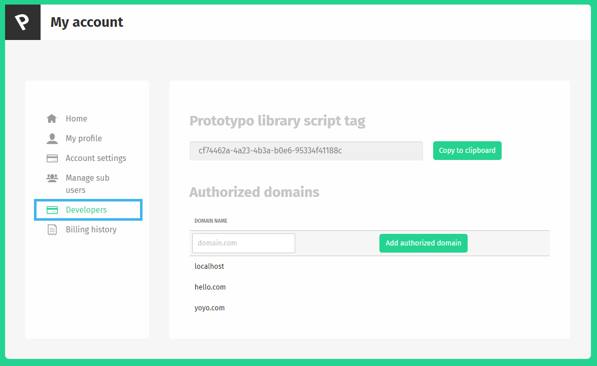

# Introduction

The Prototypo library is a javascript library that will let you control fonts using javascript. You'll be able to create typefaces from Prototypo's template and change their shapes.

This documentation the differents functionalities of the library and how to use them. Some examples are shown at the end.

# Getting started

## Setting yourself up
> Basic html markup to import the library

```html
<html>
	<head>
	</head>
	<body>
		<!-- Your web content -->
		<script src="https://library.prototypo.io/ptypo.js"></script>
	</body>
</html>
```

> Your token should look like something like this cf74462a-4a23-4b3e-40e6-95334f41168c. Here is how you'll use it:

```javascript
var prototypoFontFactory = new Ptypo.default('cf74462a-4a23-4b3a-b0e6-95334f41188c');
```

> If your not subscribed to Prototypo just use

```javascript
var prototypoFontFactory = new Ptypo.default();
```

If your subscribed to Prototypo the first thing you'll need to do is go to the Prototypo App to get you library token. This token we'll let you download the full templates from Prototypo. If your not subscribed to Prototypo your template will contain all the latin uppercases, lowercases and figures.

Your token is found in the Developers section of the account dashboard. This is how to find it.

Go there.


Then there.


Once you imported your script and created your font factory. It's time to create some fonts.

## Creating fonts

> Font creation example

```javascript
prototypoFontFactory.createFont('nameOfYourFont', Ptypo.templateNames.ELZEVIR)
	.then(function(font) {
		//You'll be able to modify your font here
	});
```

> Basic html and css example for font styling

```html
<div class="my-class">Test</div>
```
```css
.my-class {
	font-family: 'nameOfYourFont', serif;
}
```

Creating font with the library is just one call to the createFont function.
`prototypoFontFactory.create('nameOfYourFont', Ptypo.templateNames.ELZEVIR);`.

* The `nameOfYourFont` parameter should be a string and it will be the name of the font created in your browser. You'll be able to use it in css.
* The second parameter is the template that you want to use. We offer four templates: `ELZEVIR`, `FELL`, `GROTESK` and `SPECTRAL`. They correspond to the template offered by the prototypo application Elzevir, John fell, Grotesk and spectral.


<aside class="notice">
Replace <code>nameOfYourfont</code> by the name of your choice. All the template name must be you as <code>Ptypo.templateNames.GROTESK</code>
</aside>

## Changing the parameters

> Parameter change example

```javascript
prototypoFontFactory.createFont('nameOfYourFont', Ptypo.templateNames.ELZEVIR)
	.then(function(font) {
		font.changeParam('thickness', 100);
		font.changeParams({
			xHeight: 600,
			width: 1.1,
		});
	});
```

Changing the parameters of the font is as easy as creating it. Just call the `changeParam` method on the object returned by `createFont`. You can see what parameters are available in the API documentation.

Here you go! You've created a font and are ready to customize it.

# API documentation

## Font creation

### Ptypo.default.createFont

Ptypo.default.createFont( *fontName*, *templateName* )

#### Arguments 

| name     | type   | description            |
|----------|--------|------------------------|
| fontName | string | The `fontName` parameter is the name that the font will take in your css style. i.e if `fontName` is `hello` you should use `font-family: 'hello'`| 
| templateName | Ptypo.templateNames | the `templateName` specifies the parametric template you will use. It can take the values `Ptypo.templateNames.ELZEVIR`, `Ptypo.templateNames.SPECTRAL`, `Ptypo.templateNames.GROTESK` and `Ptypo.templateNames.FELL`| 

#### Return value

A promise that resolve to a `PtypoFont` object. This object is used to manipulate the font created.

## PtypoFont class

### PtypoFont.changeParam

Ptypo.changeParam( *paramName*, *paramValue* )

#### Arguments 

| name     | type   | description            |
|----------|--------|------------------------|
| paramName | string | The name of the parameter to be changed| 
| paramValue | number | The new value of the parameter specified | 

### PtypoFont.changeParams

Ptypo.changeParams( *paramObject* )

#### Arguments 

| name     | type   | description            |
|----------|--------|------------------------|
| paramObject | Object | an object of the shape `paramName: paramValue` containing the name of the values to be changed and their values| 

### PtypoFont.values

Ptypo.values

### Return value

contains the current value of the parameters. i.e Ptypo.values.width returns the current value of the width parameter

#### Parameter names and values

| Name | Min advised | Max advised | Behavior |Affected Letters|
|------|:---------------------:|:-----------------:|----------|----|
|xHeight|300|900|Change the base height of every character| All letters|
|capDelta|100|400|Change the height of capital letters| Capital letters
|ascender|150|500|Change the height of ascender on ascender letters| b, d, f, h, k, l |
|descender|-500|-150|Change the height of descender on descender letters| g, j, p, q, y|
|crossbar|0.8|1.1|Change the height of the crossbar on letters with crossbars| a, e, A, B, E, F, H, P, R|
|width|0.5|2|Change the width of every characters|All letters|
|slant|-5|12|Change the slant of every characters|All letters|
|thickness|50|160|Change the thickness of the strokes|All letters|
|aperture|0.5|1.6|Change the size of the aperture of letters (see [here](https://typography.guru/term/aperture-r10/) for more info)|a, e, c, s, t, r, C, G, S|
|curviness|0.4|1.0|Change the curviness of letters. A really curved 'o' has a square shape, a non curved 'o' has a classic diamond shape|All letters|
|serifWidth|1|90|Change the width of serifs (How long the serifs are)|All letters|
|serifHeight|0|70|Change the height of serifs (How thick the serifs are)|All letters|
|midWidth|0.5|1.2|See anatomy of a serif|All letters|
|serifMedian|0.2|1.3|See anatomy of a serif|All letters|
|serifCurve|0|100|See anatomy of a serif|All letters|
|serifRoundness|0|1.8|See anatomy of a serif|All letters|
|serifArc|0|0.1|See anatomy of a serif|All letters|
|serifTerminal|0|0.7|See anatomy of a serif|All letters|
|serifTerminalCurve|0|1.5|See anatomy of a serif|All letters|

# Anatomy of a serif

### Serif height

### Serif width

### Serif middle width

### Serif median

### Serif curve

### Serif roundness

### Serif arc

### Serif terminal

### Serif terminal curve


# Examples

## Changing thickness with background

The first examples is all about consistency. For font to feel consistently thick dark font on light background have to slighty heavier than light font on dark background. This is due to the light characters bleeding on the dark background.

In this example we create a simple text that can be switched from light mode to dark mode. We adjust the thickness of the font accordingly. We use a transition to mask the small computing time of the font.

<p data-height="516" data-theme-id="0" data-slug-hash="bRKbxY" data-default-tab="result" data-user="FranzPoize" data-embed-version="2" data-pen-title="bRKbxY" class="codepen">See the Pen <a href="https://codepen.io/FranzPoize/pen/bRKbxY/">bRKbxY</a> by Francois Poizat (<a href="https://codepen.io/FranzPoize">@FranzPoize</a>) on <a href="https://codepen.io">CodePen</a>.</p>

## Fitting heights to container

Ok let's get crafty for this second example. You can check how the titles resize by resizing your window.

<p data-height="502" data-theme-id="0" data-slug-hash="vZrRVW" data-default-tab="result" data-user="FranzPoize" data-embed-version="2" data-pen-title="vZrRVW" class="codepen">See the Pen <a href="https://codepen.io/FranzPoize/pen/vZrRVW/">vZrRVW</a> by Francois Poizat (<a href="https://codepen.io/FranzPoize">@FranzPoize</a>) on <a href="https://codepen.io">CodePen</a>.</p>

### Creating the fonts and initialization

```javascript
ptypoFactory.createFont('titleFont', Ptypo.templateNames.GROTESK).then(function(font) {
  font.changeParams({
    //Params
  });
});

ptypoFactory.createFont('subFont', Ptypo.templateNames.GROTESK).then(function(font) {
  font.changeParams({
    //Params
  });
});

ptypoFactory.createFont('textFont', Ptypo.templateNames.ELZEVIR).then(function(font) {
  font.changeParam('thickness', 60);
});
```

We start By creating three fonts. Two for the different level of headings and one for the body. We use the batch update to initialize the fonts parameters.
<div style="clear:both"></div>
### Finding the right formula for the width


```html
<span style="font-family: 'titleFont' id="test-font-width">Article</span>
```

```javascript
//Base width for the font
ptypoFactory.createFont('titleFont', Ptypo.templateNames.GROTESK).then(function(font) {
  font.changeParams({
    'xHeight': 602,
    'thickness': 160,
    'capDelta': 280,
    'ascender': 310,
    'aperture': 1.2,
    'spacing': 0.8,
    'width': 0
  });

  console.log('w1', document.getElementById('test-font-width').clientWidth);

  //Second that helps us find the function to compute the width of the text
  //with respect to the width parameters
  font.changeParams({
    'xHeight': 602,
    'thickness': 160,
    'capDelta': 280,
    'ascender': 310,
    'aperture': 1.2,
    'spacing': 0.8,
    'width': 1
  });
  console.log('w2', document.getElementById('test-font-width').clientWidth);
});
```
Using this we get two width value for the heading, which we will call w1 and w2 respectively. Here is the theoretical width of the text given the width parameter:

<p style="text-align:center">$$textWidth = w1 + (w2 - w1) \times widthParam$$</p>

So to find the widthParam we have the following formula:

<p style="text-align:center">$$widthParam = \frac{(textWidth - w1)}{(w2 - w1)}$$</p>

<div style="clear:both"></div>
### Putting it to good use

```javascript
window.addEventListener('resize', _.throttle(function(e) {
    var containerWidth = containerDiv.clientWidth;
    var width = Math.max(0, (containerWidth - baseTitleWidth) / 94)
    
    font.changeParam('width', width);
  }, 300));
```

This is how we get the two formulas for the width. We just need to add a listener for the resize event on the window to trigger the generation of updated fonts. We use a throttle to avoid to many calculation.

<script async src="https://production-assets.codepen.io/assets/embed/ei.js"></script>
<script src='https://cdnjs.cloudflare.com/ajax/libs/mathjax/2.7.0/MathJax.js?config=TeX-MML-AM_CHTML'></script>
